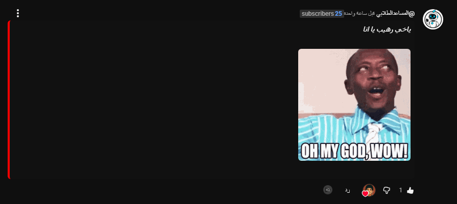

## Overview

The **YouTube Markdown Comments Extension** is a lightweight browser extension for **Chrome and Edge** that allows users to render Markdown directly inside YouTube comments. By simply prefixing a comment with:

```

$youtube_md

````

the extension will automatically:

- Convert **Markdown syntax** (bold, italic, headers, lists, links) to HTML
- Render **images** and **GIFs** properly
- Support **inline code** and **code blocks** (` ` `)
- Display comments in a visually enhanced, readable format

All changes are **client-side only**, ensuring that your YouTube account and server data remain untouched.


## Features

- ✅ Render Markdown in YouTube comments using `$youtube_md`
- ✅ Supports **headers**, **bold**, **italic**, **inline code**, and **code blocks**
- ✅ Display **images** and **GIFs** with responsive layout
- ✅ Handle **lists** and **links** elegantly
- ✅ Lightweight and fully **client-side**, no server interaction
- ✅ Works on **Chrome** and **Edge**

---

## Installation

1. Download or clone this repository, focus in `youtube-md-extension`

2. Open your browser extensions page:

* **Chrome:** `chrome://extensions/`
* **Edge:** `edge://extensions/`

3. Enable **Developer Mode**.

4. Click **Load unpacked** and select the folder containing the extension (`youtube-md-extension`).

5. Refresh YouTube and enjoy Markdown rendering in comments!


## Usage

1. Post a comment on any YouTube video starting with:

```
$youtube_md
```

2. Write your comment using Markdown syntax, for example:

````markdown
$youtube_md
# Heading
**Bold Text**
*Italic Text*


````

3. The extension will automatically render the Markdown into a visually formatted HTML comment.


## Screenshot



## Contribution

Feel free to contribute, suggest improvements, or report issues via GitHub Issues.  
Any pull requests to enhance features or compatibility are welcome.


## License

This project is licensed under the MIT License. See the [LICENSE](LICENSE) file for details.
